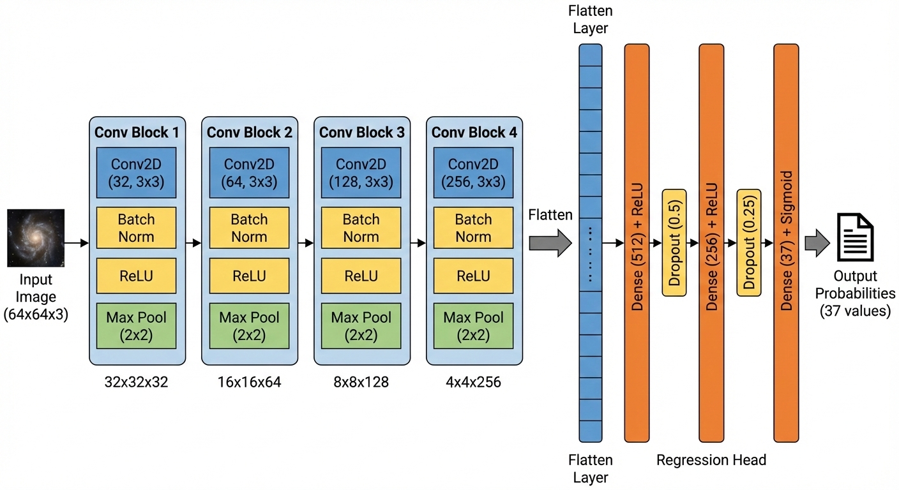
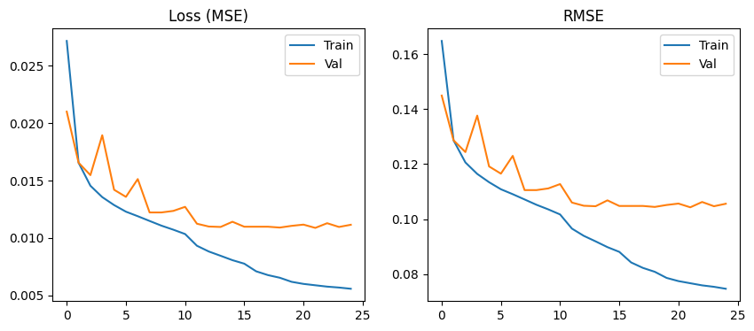

# 🌌 Automated Morphological Classification of Galaxies
### A Deep Learning Approach using Custom VGG Architecture


---

## 📌 Project Overview
The morphological classification of galaxies is a fundamental task in observational cosmology. This project automates the process using a custom-designed **Convolutional Neural Network (CNN)** trained on the **Galaxy Zoo** dataset.

Unlike "black box" solutions, this repository implements a transparent, rigorous **5-phase experimental pipeline** designed to isolate and optimize architectural decisions.

### 🎯 Key Objectives
* **Precision:** Predict 37 probabilistic morphological features (e.g., "Smooth", "Spiral", "Bar") with an RMSE < 0.11.
* **Efficiency:** Design a lightweight architecture ($\approx 2.6$M parameters) capable of real-time inference.
* **Interpretability:** Visualize internal feature maps to ensure the model learns physical geometric primitives.

---

## 📂 Repository Organization
The project is organized into three modular directories:

* **`doc/`** - Documentation and Reports
  * 📄 [final_report.pdf](doc/final_report.pdf) - IEEE-formatted scientific paper.
* **`src/`** - Source Code & Models
  * 📓 [main.ipynb](src/main.ipynb) - Jupyter Notebook with the full training pipeline.
* **`assets/`** - Images and Visualizations (Displayed below).

---

## 🧠 Model Architecture
We implemented a **Custom VGG-style CNN** optimized for $64 \times 64$ pixel input resolution. The network avoids the computational bloat of standard pre-trained models by stacking small $3 \times 3$ filters in a modular design.


*Figure 1: Schematic of the Custom VGG Architecture. Note: The final deployed model utilizes an optimized Dropout rate of 0.2 based on sensitivity analysis results.*

**Technical Specifications:**
* **Input:** $64 \times 64 \times 3$ (RGB Images)
* **Encoder:** 4 Convolutional Blocks ($32 \to 64 \to 128 \to 256$ filters).
* **Regularization:** Batch Normalization + Max Pooling ($2\times2$) + Dropout ($0.2$).
* **Optimizer:** Adam ($\alpha = 10^{-3}$) with dynamic learning rate annealing.

---

## 📊 Experimental Results

### 1. Performance Metrics
Our model was evaluated on a blind test set of 79,975 unlabelled galaxies via the Kaggle platform.

| Metric | Value | Context |
| :--- | :--- | :--- |
| **Validation RMSE** | **0.104** | Internal evaluation on 20% holdout set. |
| **Test RMSE** | **0.109** | **External blind evaluation.** |
| **Inference Latency** | **57.29 ms** | Average time to process a single image. |
| **Throughput** | **17.5 Hz** | Real-time processing speed (Single-shot mode). |

### 2. Training Dynamics
The model demonstrates stable convergence with no significant overfitting.


*Figure 2: Training dynamics showing the convergence of Mean Squared Error (Loss) and RMSE over 25 epochs.*

---

## 🔬 Interpretability
To verify that the model is learning meaningful physics rather than memorizing noise, we visualized the weights of the first convolutional layer.


*Figure 4: Visualization of the 32 learned kernels ($3 \times 3$) in the first layer. The emergence of **Edge Detectors** (vertical/horizontal gradients) and **Center-Surround Detectors** (blobs) confirms successful feature extraction.*

---

## 🚀 Getting Started

### Prerequisites
* Python 3.8+
* TensorFlow 2.x
* Pandas, NumPy, Matplotlib, Scikit-Learn

### Installation
1.  **Clone the repository:**
    ```bash
    git clone [https://github.com/YOUR_USERNAME/Galaxy-Morphology-CNN.git](https://github.com/YOUR_USERNAME/Galaxy-Morphology-CNN.git)
    cd Galaxy-Morphology-CNN
    ```

2.  **Install dependencies:**
    ```bash
    pip install tensorflow pandas numpy matplotlib scikit-learn
    ```

3.  **Run the analysis:**
    Navigate to the `src/` folder and launch the Jupyter Notebook:
    ```bash
    cd src
    jupyter notebook main.ipynb
    ```

---

## 📄 Citation
If you use this code or methodology in your research, please refer to the full scientific report:

> **Automated Morphological Classification of Galaxies using Deep Convolutional Architecture**
> *N. Mavros (2026).*
> [Read the full paper (PDF)](doc/final_report.pdf)

---
*University of Thessaly - Department of Electrical & Computer Engineering*
