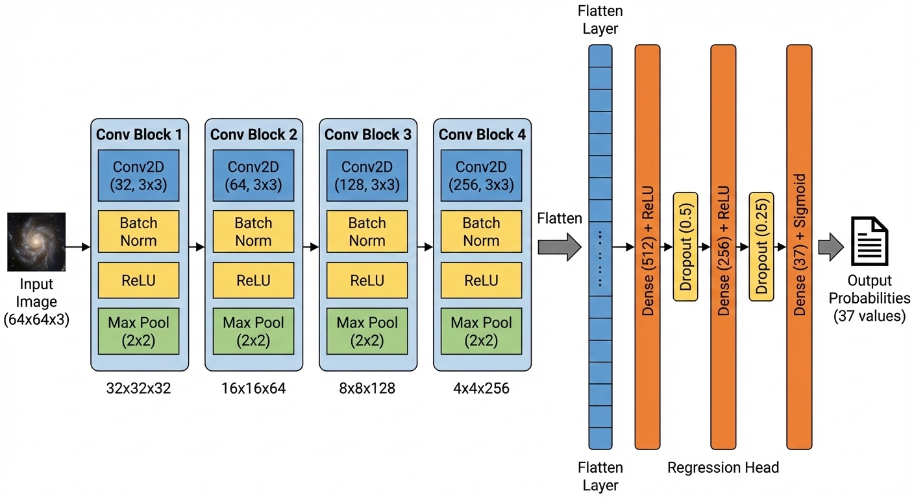
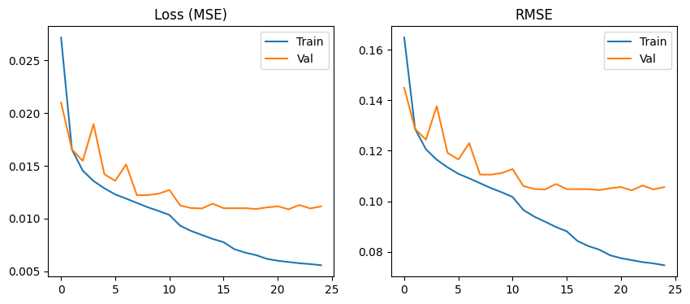
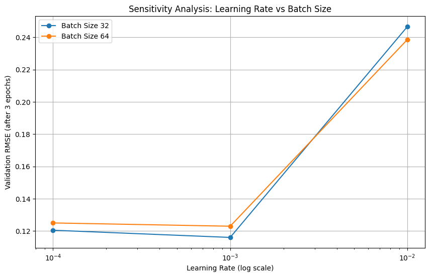
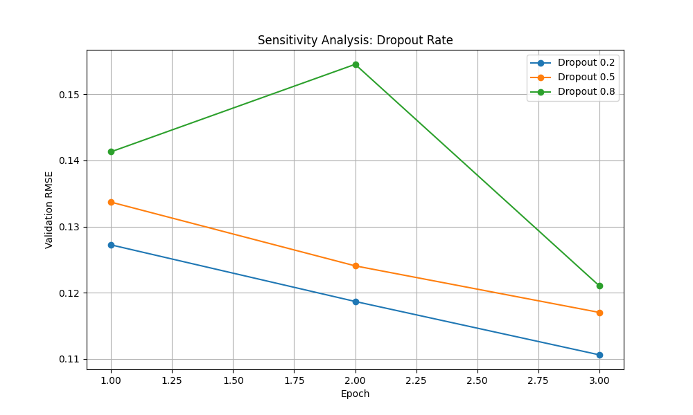
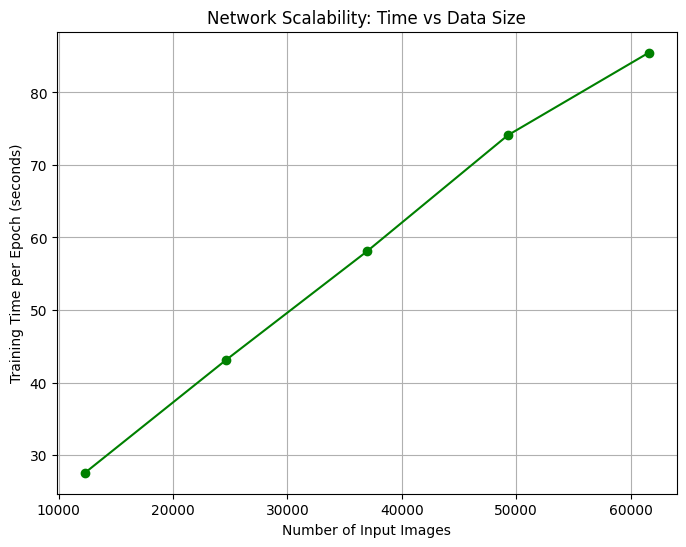
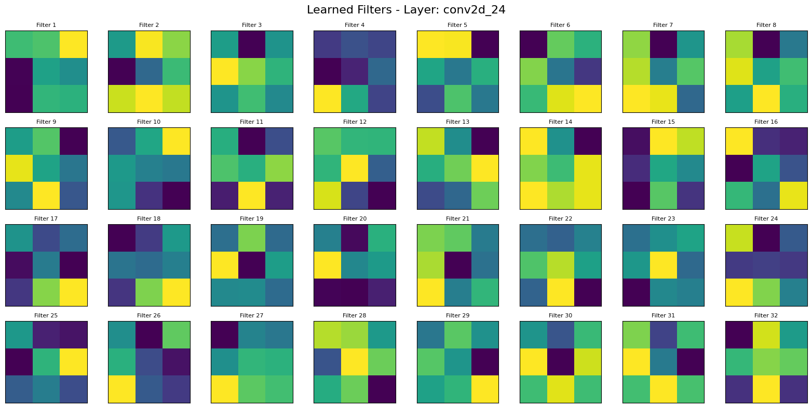
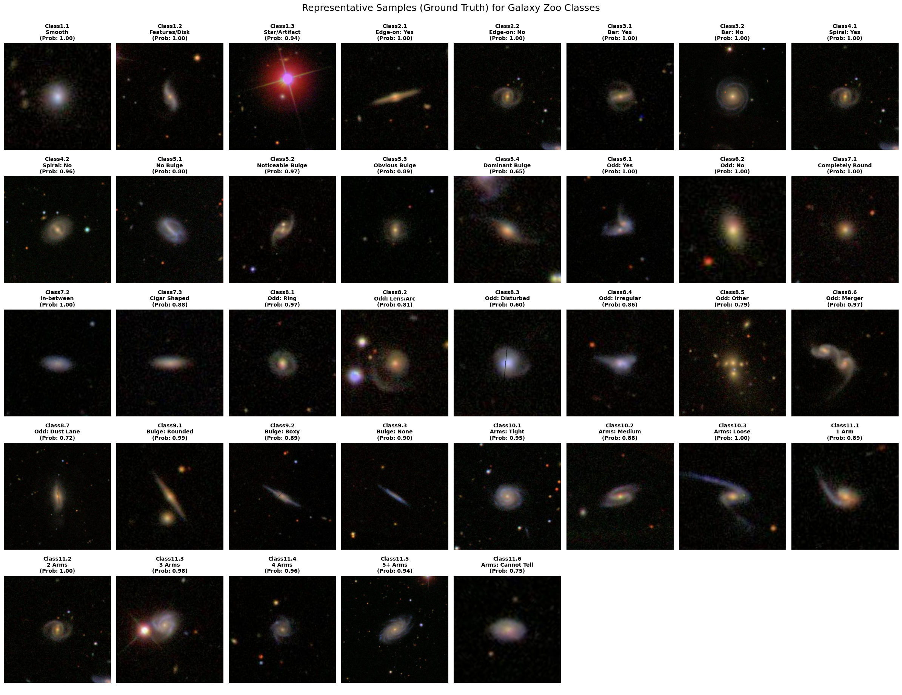

# 🌌 Automated Morphological Classification of Galaxies
### A Deep Learning Approach using Custom VGG Architecture


---

## 📌 Project Overview
The morphological classification of galaxies is a fundamental task in observational cosmology. This project automates the process using a custom-designed **Convolutional Neural Network (CNN)** trained on the **Galaxy Zoo** dataset.

Unlike "black box" solutions, this repository implements a transparent, rigorous **5-phase experimental pipeline** designed to isolate and optimize architectural decisions.

### 🎯 Key Objectives
* **Precision:** Predict 37 probabilistic morphological features (e.g., "Smooth", "Spiral", "Bar") with an RMSE of **less than 0.1**.
* **Efficiency:** Design a lightweight architecture (**approx. 2.6M** parameters) capable of real-time inference.
* **Interpretability:** Visualize internal feature maps to ensure the model learns physical geometric primitives.
---

## 📂 Repository Organization
The project is organized into four modular directories:

* **`doc/`** - Documentation and Reports
  * 📄 [neuro_fuzzy_final.pdf](doc/neuro_fuzzy_final.pdf) - IEEE-formatted scientific paper.
* **`src/`** - Source Code
  * 📓 [main.ipynb](src/main.ipynb) - Jupyter Notebook with the full training pipeline (executed, with outputs).
* **`models/`** - Trained Weights & Predictions
  * 🧠 [my_galaxy_model_backup.keras](models/my_galaxy_model_backup.keras) - Trained model (~31 MB), ready for inference.
  * 📈 [galaxy_zoo_submission.csv](models/galaxy_zoo_submission.csv) - Predictions for the 79,975 blind test galaxies (Kaggle submission format).
* **`assets/`** - Images and Visualizations (Displayed below).

---

## 🧠 Model Architecture
We implemented a **Custom VGG-style CNN** optimized for $64 \times 64$ pixel input resolution. The network avoids the computational bloat of standard pre-trained models by stacking small $3 \times 3$ filters in a modular design.


*Figure 1: Schematic of the Custom VGG Architecture. Note: The final deployed model utilizes an optimized Dropout rate of 0.2 based on sensitivity analysis results.*

**Technical Specifications:**
* **Input:** $64 \times 64 \times 3$ (RGB Images)
* **Encoder:** 4 Convolutional Blocks ($32 \to 64 \to 128 \to 256$ filters).
* **Regularization:** Batch Normalization + Max Pooling ($2\times2$) + Dropout ($0.2$).
* **Optimizer:** Adam ($\alpha = 10^{-3}$) with dynamic learning rate annealing.

---

## 📊 Experimental Results

### 1. Performance Metrics
Our model was evaluated on a blind test set of 79,975 unlabelled galaxies via the Kaggle platform.

| Metric | Value | Context |
| :--- | :--- | :--- |
| **Validation RMSE** | **0.104** | Internal evaluation on 20% holdout set. |
| **Test RMSE** | **0.109** | **External blind evaluation.** |
| **Inference Latency** | **57.29 ms** | Average time to process a single image. |
| **Throughput** | **17.5 Hz** | Real-time processing speed (Single-shot mode). |

### 2. Training Dynamics
The model demonstrates stable convergence with no significant overfitting.


*Figure 2: Training dynamics showing the convergence of Mean Squared Error (Loss) and RMSE over 25 epochs.*

### 3. Sensitivity Analysis: Learning Rate & Batch Size
A grid over learning rates ($10^{-4}$, $10^{-3}$, $10^{-2}$) and batch sizes (32, 64) identified $\alpha = 10^{-3}$ as the optimum. An aggressive $10^{-2}$ rate destabilises training, roughly doubling the error.


*Figure 3: Validation RMSE after 3 epochs as a function of learning rate (log scale) for batch sizes 32 and 64.*

### 4. Sensitivity Analysis: Dropout Rate
Aggressive regularization proved counter-productive for this architecture: a rate of $0.8$ starves the network of capacity, while $0.2$ converges fastest and lowest.


*Figure 4: Validation RMSE per epoch for Dropout rates of 0.2, 0.5 and 0.8. The 0.2 configuration was selected for the final model.*

### 5. Scalability
Training cost grows approximately **linearly** with dataset size, confirming that the pipeline is not bottlenecked by memory or I/O.


*Figure 5: Training time per epoch versus number of input images (~27 s at 12k images to ~85 s at 61k images).*

---

## 🔬 Interpretability
To verify that the model is learning meaningful physics rather than memorizing noise, we visualized the weights of the first convolutional layer.


*Figure 6: Visualization of the 32 learned kernels (3x3) in the first layer. The emergence of **Edge Detectors** (vertical/horizontal gradients) and **Center-Surround Detectors** (blobs) confirms successful feature extraction.*

### The 37-Class Decision Tree
Each galaxy is described by 37 probabilistic answers following the Galaxy Zoo decision tree. Below is a representative ground-truth example for every class.


*Figure 7: Representative samples for all 37 Galaxy Zoo classes, annotated with the class label and its ground-truth probability. An unlabelled version of this grid is available in [assets/samples.png](assets/samples.png).*

---

## 🚀 Getting Started

### Prerequisites
* Python 3.8+
* TensorFlow 2.x
* Pandas, NumPy, Matplotlib, Scikit-Learn

### Installation
1.  **Clone the repository:**
    ```bash
    git clone https://github.com/mavroul1s/Galaxy-Morphology-CNN.git
    cd Galaxy-Morphology-CNN
    ```

2.  **Install dependencies:**
    ```bash
    pip install tensorflow pandas numpy matplotlib scikit-learn
    ```

3.  **Run the analysis:**
    Navigate to the `src/` folder and launch the Jupyter Notebook:
    ```bash
    cd src
    jupyter notebook main.ipynb
    ```
    The notebook downloads the [Galaxy Zoo - The Galaxy Challenge](https://www.kaggle.com/c/galaxy-zoo-the-galaxy-challenge) data via the Kaggle API, so you will need your own `kaggle.json` API token. The raw images are **not** stored in this repository.

### Using the Pre-trained Model
Skip training entirely and load the weights shipped in `models/`:

```python
from tensorflow import keras

model = keras.models.load_model("models/my_galaxy_model_backup.keras")
predictions = model.predict(images)   # images: (N, 64, 64, 3), scaled to [0, 1]
```

---

## 📄 Citation
If you use this code or methodology in your research, please refer to the full scientific report:

> **Automated Morphological Classification of Galaxies using Deep Convolutional Architecture**
> *N. Mavros (2026).*
> [Read the full paper (PDF)](doc/neuro_fuzzy_final.pdf)

---

## 📜 License
Distributed under the MIT License. See [LICENSE](LICENSE) for details.

---
*University of Thessaly - Department of Electrical & Computer Engineering*
